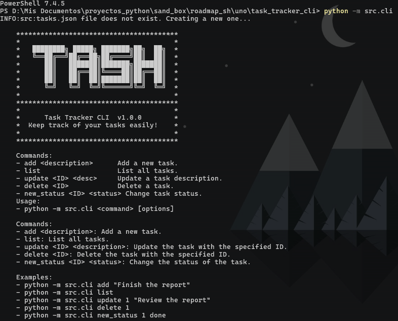

---

# Task Tracker CLI



A simple yet efficient task tracker that allows you to manage your tasks from the command line. **Task Tracker CLI** helps you organize and keep track of your daily tasks, allowing you to add, update, delete, and change task statuses directly from the terminal.

## Features

- **Add Tasks**: Add a task with a given description.
- **List Tasks**: Display all tasks with their ID, description, and status.
- **Update Tasks**: Update the description of an existing task.
- **Delete Tasks**: Delete a task by its ID.
- **Change Task Status**: Change the status of a task to "to-do", "in-progress", or "done".

## Requirements

- Python 3.6 or higher.

## Installation

1. Clone the repository:

```bash
git clone https://github.com/Jonatanciencias/task_tracker_cli.git
```

2. Navigate to the directory:

```bash
cd task_tracker_cli
```

3. Set up a virtual environment (optional but recommended):

```bash
python -m venv venv
source venv/bin/activate  # On Windows: venv\Scripts\activate
```

4. Run help

```bash
python -m src.cli
```

## Usage

### Commands:

1. **Add Task**:

```bash
python -m src.cli add "Task description"

```

2. **List Tasks**:

```bash
python -m src.cli list

```

3. **Update Task**:

```bash
python -m src.cli update <ID> "New description"

```

4. **Delete Task**:

```bash
python -m src.cli delete <ID>
```

5. **Change Status**:

```bash
python -m src.cli new_status <ID> <status>
```

## Testing

Unit tests are included to ensure the core functions work correctly. To run the tests:

```bash
python -m unittest discover tests
```
## Original Project

This project is an implementation of the **Task Tracker CLI**, based on the projects proposed by **[roadmap.sh](https://roadmap.sh/projects/task-tracker)**.

## Contributions

Contributions are welcome! Please open an issue or submit a pull request.

---

### Repositorio GitHub:

**[https://github.com/Jonatanciencias/task_tracker_cli](https://github.com/Jonatanciencias/task_tracker_cli)**